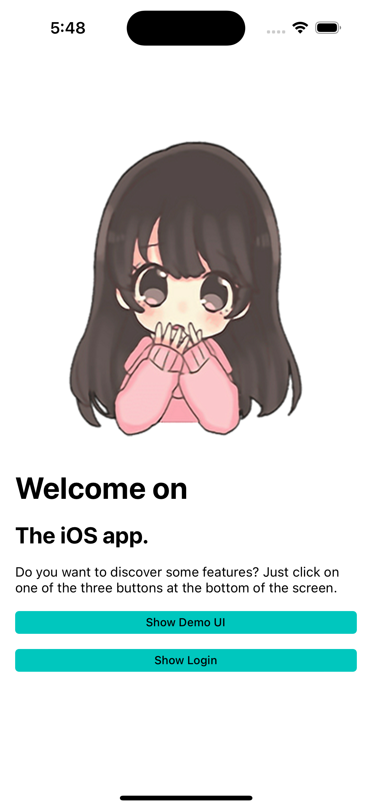
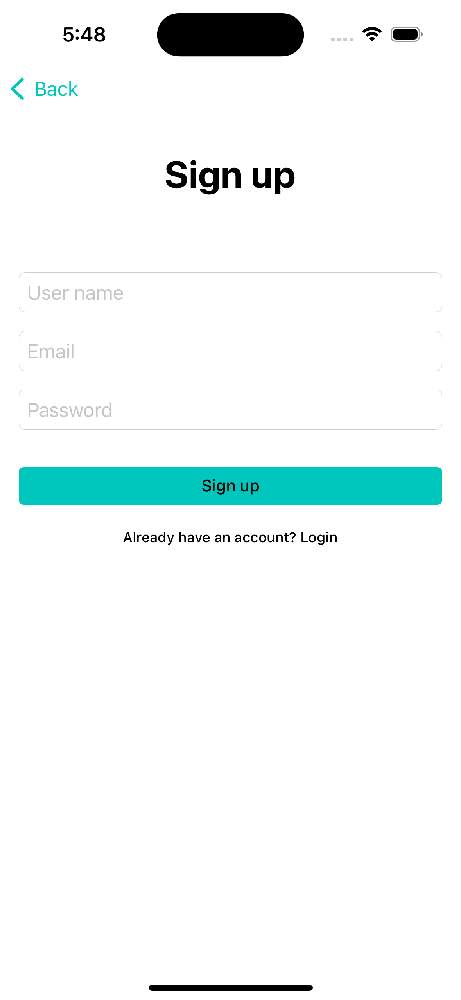
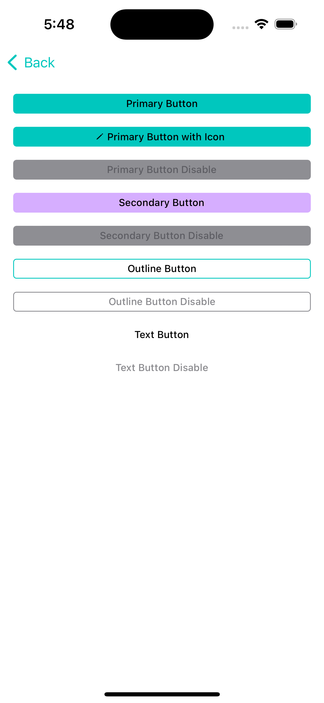

<div align="center">
    
</div>

# iOS Swift boilerplate
Creating a new project from the Xcode default template is very painful. We need to prepare all settings that will use in the project first like finding libraries, extensions, set configuration in Xcode, etc before starting coding on functionality. These are boring activities. Because of that, I create this starter to make all that activities simpler and faster. All useful and often use methods will include when creating a new project, so we don't need to find that method again and again. Just focus on finding the specific method You need for Your new project.

## Installation
- Download template
    ```
    git clone it@github.com:GoldenOwlAsia/mobile-ios-swift-template.git
    ```
- After Don't forget to run `pod install`. 

## Dependencies
- Alamofire
- IQKeyboardManagerSwift
- SwiftyJSON
- Kingfisher
- L10n-swift
- Firebase


## Directory layout 🗂️
    |- networks/
    |- services/
    |- feature/
        |- dashboard/
            |- widget/
            |- controller
            |- dashboard_screen.dart
        |- home/
        |- login/
    |- UI/
      |- button/
      |- image/
      |- view/
    |- AppDelegate.swift
    |- SceneDelegate.swift

## Features 🍌
* [ ] Localization
* [x] Theme
* [x] Navigation Stack
* [x] State Management - ViewModel
* [x] Login Flow
    * [x] Login Flow - UI
    * [ ] Login/Signup With Email
    * [ ] Login With Google
    * [ ] Login With Facebook
    * [ ] Login With Apple

## Digging Deeper 🚀
Checkout [wiki](https://github.com/GoldenOwlAsia/mobile-ios-swift-template/wiki) for more info

## Screenshot

| Home | Login | buttons |
|------------|-------------|-------------|
|   |   |  |

